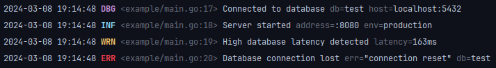

# hypera.dev/lib/slog/pretty

[](https://pkg.go.dev/hypera.dev/lib/slog/pretty#section-documentation)

A human-readable and optionally coloured [**slog.Handler**](https://pkg.go.dev/log/slog#Handler).

The output format is designed to be quick and easy to read, primarily for use in development environments.
This format is not necessarily recommended for production environments, especially where logs need to be parsed to
extract data.



```shell
go get -u hypera.dev/lib/slog/pretty
```

## Usage

```go
// Create a new logger
log := slog.New(pretty.NewHandler(os.Stdout, nil))

// Set global logger and use custom options
slog.SetDefault(slog.New(
	pretty.NewHandler(os.Stdout, &pretty.Options{
		Level:         slog.LevelDebug,
		AddSource:     true,
	}),
))
```

## Customisable

It is possible to customise how certain parts of the output are formatted by passing different formatters in
`pretty.Options`. It is not currently possible to reorder parts of the output, however this feature may be added in
the future.

### Time formatter

```go
// Change the time format using the default formatter
pretty.NewHandler(w, &pretty.Options{
	TimeFormatter: pretty.DefaultTimeFormatter(time.DateTime),
}),

// Use a custom time formatter
pretty.NewHandler(w, &pretty.Options{
	TimeFormatter: func(buf *pretty.Buffer, t time.Time) {
		buf.AppendTimeFormat(t, time.DateTime)
	},
}),
```

### Level formatter

```go
// Use the default level formatter
pretty.NewHandler(w, &pretty.Options{
	LevelFormatter: pretty.DefaultLevelFormatter(color),
}),

// Use a custom level formatter
pretty.NewHandler(w, &pretty.Options{
	LevelFormatter: func(buf *pretty.Buffer, l slog.Level) {
		if l == LevelTrace {
			buf.AppendString("TRACE")
			return
		}
		pretty.DefaultLevelFormatter(true),
	},
}),
```

### Source formatter

```go
// Use the default source formatter
pretty.NewHandler(w, &pretty.Options{
	LevelFormatter: pretty.DefaultSourceFormatter(color),
}),

// Use a custom source formatter
pretty.NewHandler(w, &pretty.Options{
	SourceFormatter: func(buf *pretty.Buffer, src *slog.Source) {
		dir, file := filepath.Split(src.File)

		buf.AppendByte('<')
		buf.AppendString(filepath.Join(filepath.Base(dir), file))
		buf.AppendByte(':')
		buf.AppendInt(int64(src.Line))
		buf.AppendByte('>')
	},
}),
```

## Extras

### Automatic color toggle

Colored output is enabled by default and can be disabled by setting `DisableColor: false` in the handler options.
You can have colors automatically enabled depending on the terminal capabilities with the use of a package
like [`github.com/mattn/go-isatty`](https://github.com/mattn/go-isatty).

```go
w := os.Stdout
pretty.NewHandler(w, &pretty.Options{
	DisableColor: !isatty.IsTerminal(w.Fd()),
}),
```

### Windows support

Colors may display weirdly on Windows, and can be corrected with use of
the [`github.com/mattn/go-colorable`](https://github.com/mattn/go-colorable) package.

```go
w := os.Stdout
pretty.NewHandler(colorable.NewColorable(w), nil)
```

## Acknowledgements

The output format is heavily inspired by [`github.com/charmbracelet/log`](https://github.com/charmbracelet/log)
and [`github.com/lmittmann/tint`](https://github.com/lmittmann/tint).

`github.com/lmittmann/tint` is a great alternative to this library, however it does not currently support custom time,
level or source formatters.
